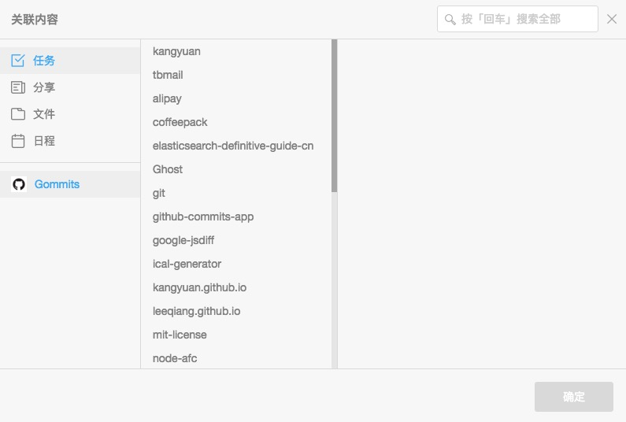
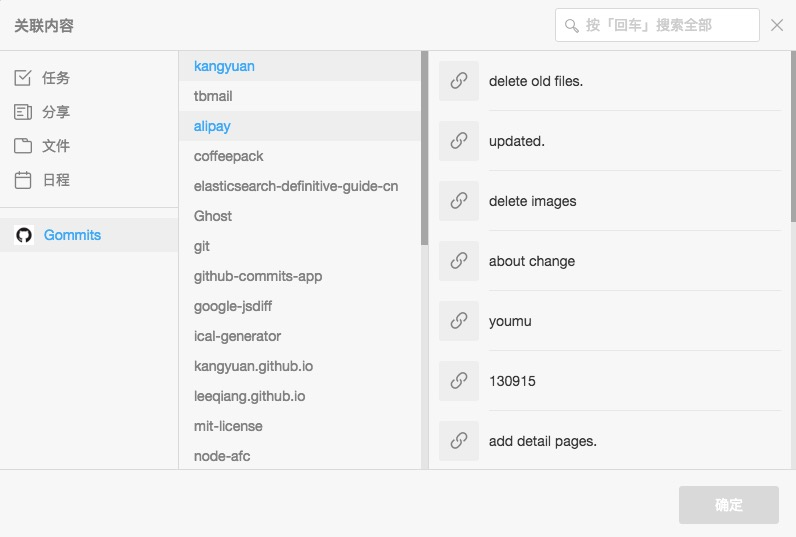

# 关联 GitHub Commits 插件开发手册

该插件支持将 GitHub Commits 关联到 Teambition 任务上。

## 配置文件
```json
{
  "name": "GitHub Commits App For Teambition",
  "host": "http://example.com",
  "git": {
    "user": "",
    "token": "",
    "description": "进入到 GitHub 个人设置页面，生成 token 信息"
  },
  "app": {
    "client_id": "",
    "client_secret": "",
    "description": "创建 teambition 应用，并配置 client_id & client_secret"
  }
}
```

## Gommits(GitHub Commits)效果图

获取 repository 列表


获取 commits 列表


* [开发手册](./tutorial.md)

# License

MIT
